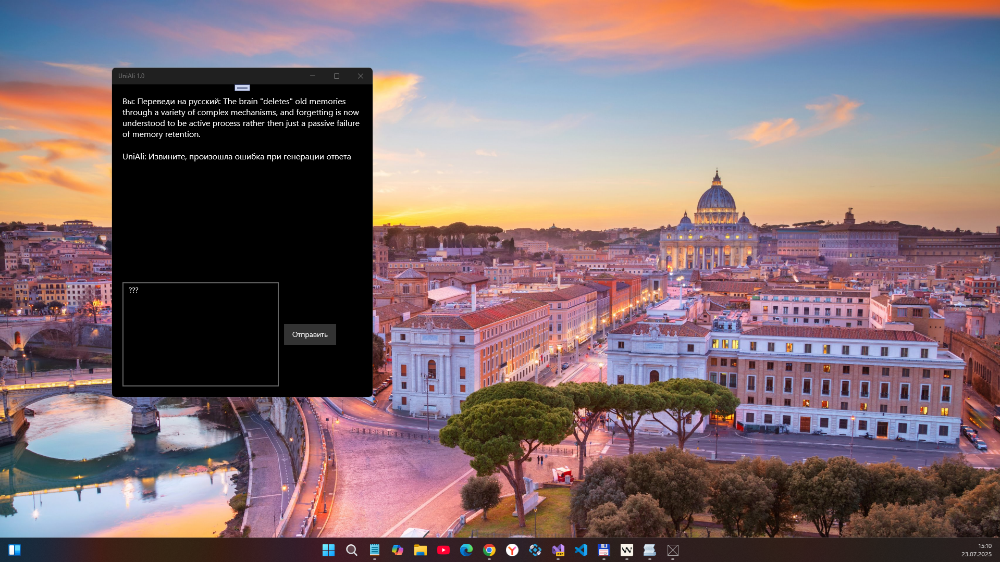

# UniAli v1.0-alpha - main branch


Это спонтанная попытка примотать легковесную Alibaba LLM к UWP. Пока не взлетело. Из сорцов (папка Assets) свою тестовую модель model_quantized.onnx удалил, ибо весит она под гиг. Если кому интересно повозиться с этим делом, сами залогинтесь а ХаггингФейсе и качните что-то типа https://huggingface.co/onnx-community/Qwen3-0.6B-ONNX . [Майковская LM-шарманка](https://github.com/microsoft/onnxruntime), так понял, возмущается моим кривым токенайзером. Ну да, к каждой модели, наверное, лучше его делать как следует. Возможно, стоит посмотреть нутро https://huggingface.co/onnx-community/Qwen3-0.6B-ONNX/blob/main/tokenizer.json и вообще всё то, что лежит в папке https://huggingface.co/onnx-community/Qwen3-0.6B-ONNX/tree/main . Как то так.


## Скриншот



## Status
- Лишь наборосок, пока не пашет
- Магия совместимости с W10M еще не добавлено, ибо софтина не работает

## Environment
- Windows SDK Target Version: 10.0.19041.0
- Windows SDK Min. Version:   10.0.16299.0 

# Прототип UWP-приложения UniAli для запуска LLM на Windows 10 Mobile

## Обзор
Был создан прототип UWP-приложения UniAli для запуска локальной языковой модели на устройствах с Windows 10 Mobile, включая Lumia 950. Проект использует фреймворк ONNX Runtime от Microsoft для выполнения квантованной модели Qwen3.

## Архитектура и реализация

### Фреймворк
Для выполнения модели был выбран **ONNX Runtime** - кросс-платформенный фреймворк для выполнения моделей машинного обучения. Он поддерживает UWP-приложения и оптимизирован для работы на устройствах с ограниченными ресурсами.

### Модель
В проекте используется квантованная версия модели **Qwen1.5-0.5B-ONNX** с 500 миллионами параметров. Модель была выбрана за ее небольшой размер (~1.5 ГБ после квантования), что делает ее пригодной для запуска на мобильных устройствах с ограниченным объемом памяти.

### Структура проекта
- `Src/UniAli/` - основной проект UWP-приложения
- `Assets/` - содержит модель `model_quantized.onnx` и ресурсы приложения
- `MainPage.xaml` - пользовательский интерфейс приложения
- `MainPage.xaml.cs` - логика приложения, включая загрузку модели и генерацию ответов

### Реализованные компоненты

#### Загрузка модели
```csharp
private async void InitializeModel()
{
    var modelPath = Path.Combine(Package.Current.InstalledLocation.Path, "Assets", "model_quantized.onnx");
    _session = new InferenceSession(modelPath);
}
```

#### Генерация ответов
```csharp
private string GenerateResponse(string input)
{
    // Токенизация входного текста
    var tokens = _tokenizer.Encode(input);
    
    // Подготовка входных данных и выполнение модели
    var inputTensor = new DenseTensor<int>(tokens, new int[] { 1, tokens.Length });
    var inputs = new List<NamedOnnxValue>
    {
        NamedOnnxValue.CreateFromTensor("input_ids", inputTensor)
    };

    using (var results = _session.Run(inputs))
    {
        var output = results.FirstOrDefault(r => r.Name == "logits")?.AsTensor<float>();
        // Декодирование результата
    }
}
```

#### Пользовательский интерфейс
Был реализован простой интерфейс с:
- Областью вывода ответов модели
- Полем ввода для пользовательских запросов
- Кнопкой отправки
- Поддержкой отправки по нажатию Enter

## Совместимость
Проект настроен на работу с минимальной версией Windows 10 Mobile **build 15063**, что обеспечивает совместимость с устройствами Lumia 950.

## Дальнейшие шаги
1. Сборка приложения в appx-пакет
2. Тестирование на реальном устройстве Lumia 950
3. Оптимизация производительности и использования памяти
4. Реализация полноценного токенизатора
5. Добавление поддержки контекстного диалога
6. Оптимизация времени запуска приложения

## Заключение
Прототип UniAli демонстрирует возможность запуска современных языковых моделей на устаревших мобильных устройствах с помощью оптимизированных фреймворков и квантованных моделей. Это открывает новые возможности для использования ИИ на устройствах, которые больше не получают официальных обновлений.

## Credits / Reference(s)
- Товарищу Deleted с форума 4PDA за предложение создать эту шарманку для старых добрых винфонов
- https://huggingface.co/onnx-community/Qwen3-0.6B-ONNX Где-то тут водятся творения от энтузиастов и Ali-бабы
- https://4pda.to/forum/index.php?showtopic=1107793#entry138245556 Собственно мой случайный диалог c Deleted тут.
- https://github.com/microsoft/onnxruntime ONNX Runtime: кросс-платформенный суперпупернавороченный ML-аксселератор/тренер ML-моделей
- 

## ..
AS IS. RnD only. No support. DIY

## .
[m][e] 2025
