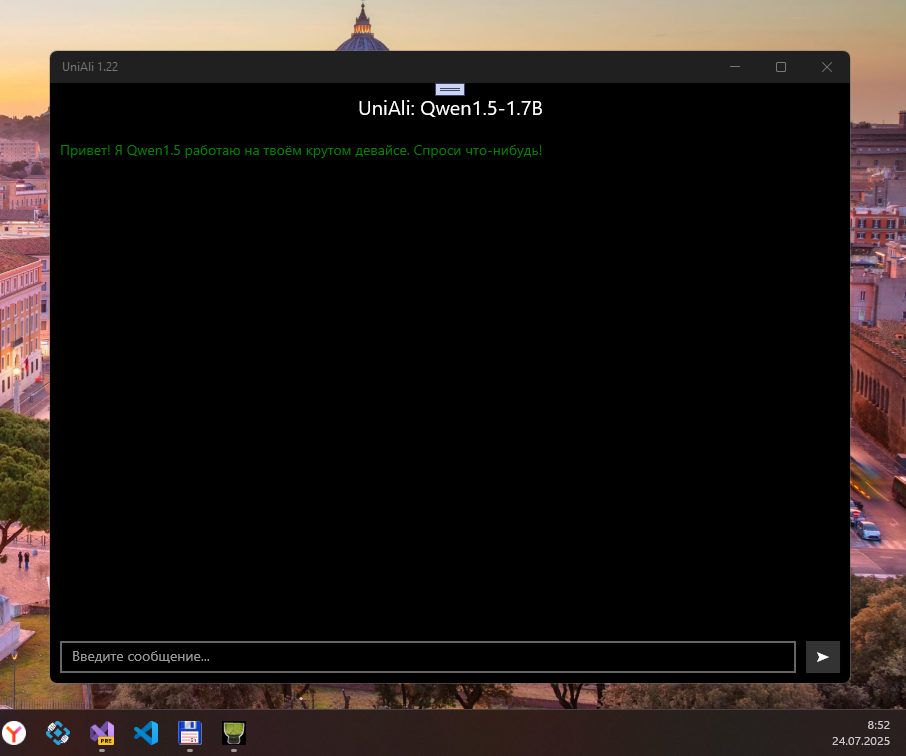

# UniAli v1.22-alpha - case2 branch

Это была моя вторая примотать легковесную Alibaba LLM к UWP. Тоже пока не взлетело, эх. В сорцы тестовая модель не входит (брал готовую тут [model_q4f16.onnx](https://huggingface.co/onnx-community/Qwen3-1.7B-ONNX)  и еще ничего не квартировал/конвертил для некой большей совместимости с Microsoft QNNX) удалил, ибо весит она под 1,33 гига (зато в какой-то момент токенайзер её даже "увидел" чуток). Видимо, на третей попытке придется через "взрослые" АИ вроде ChatGPT прогнать это творение... не знаю... нужны железные мозги, чтоб в это сербезно вникнуть! Вообщем, пока как то так. 

## Скриншот

## Status
- Лишь набросок, пока тож не пашет
- Пытался подлатать токенайзер TikTokSharp (он оказался странненьким, сыпался на попытке качнуть cl100k_base.tiktoken с Интернета и сохранить в "корень uwp-приложения", что запрещено)
- Магия совместимости с W10M не была добавлена, ибо софтина не работает

## Архитектура
- UniALi (NET Standard 2, remastered)
- TiktokenSharp (UWP, remastered)

## Environment
- Windows SDK Target Version: 10.0.19041.0
- Windows SDK Min. Version:   10.0.16299.0 

## Заключение
Прототип UniAli демонстрирует возможность запуска современных языковых моделей на устаревших мобильных устройствах с помощью оптимизированных фреймворков и квантованных моделей. Это открывает новые возможности для использования ИИ на устройствах, которые больше не получают официальных обновлений.

## Credits / Ссыли
- Товарищу Deleted с форума 4PDA за предложение создать эту шарманку для старых добрых винфонов
- https://huggingface.co/onnx-community/Qwen3-0.6B-ONNX Где-то тут водятся творения от энтузиастов и Ali-бабы
- https://4pda.to/forum/index.php?showtopic=1107793#entry138245556 Собственно мой случайный диалог c Deleted тут.
- https://github.com/microsoft/onnxruntime ONNX Runtime: кросс-платформенный суперпупернавороченный ML-аксселератор/тренер ML-моделей
- 

## ..
AS IS. RnD only. No support. DIY

## .
[m][e] 2025

